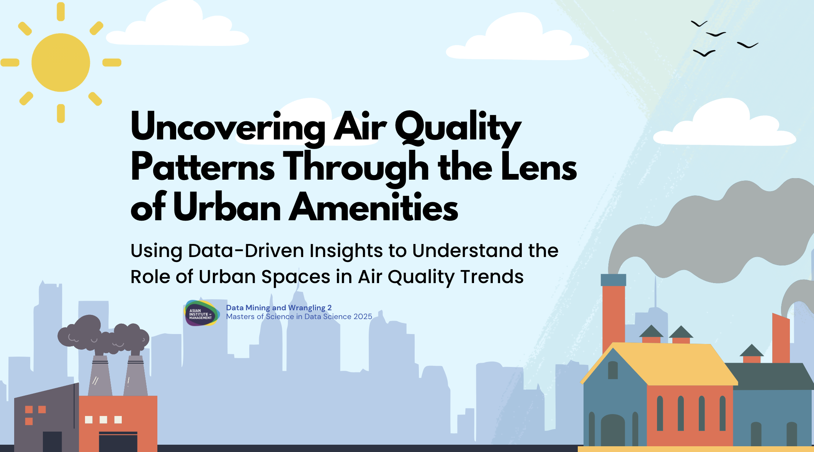

# Uncovering Air Quality Patterns Through the Lens of Urban Amenities

<strong>Francis Mark M. Cayco</strong> 
Asian Institute of Management 
Makati City, Philippines 
fcayco.MSDS2025@aim.edu

<strong>Eros Paul V. Estante</strong> 
Asian Institute of Management 
Makati City, Philippines 
eestante.MSDS2025@aim.edu

<strong>Andgrel Heber M. Jison</strong> 
Asian Institute of Management 
Makati City, Philippines 
ajison.msds2025@aim.edu

<strong>Angela Elaine F. Pelayo</strong> 
Asian Institute of Management 
Makati City, Philippines 
apelayo.msds2025@aim.edu

---

## Abstract

This study explores the relationship between urban amenities and air quality by utilizing machine learning techniques and geospatial data. By integrating air quality measurements, OpenStreetMap (OSM) amenities and spatial analytics, we identified key amenities that are commonly associated with areas of poorer air quality. Counterfactual analysis was applied to simulate potential interventions, revealing how targeted urban planning strategies could mitigate pollution exposure. These findings provide a data-driven foundation for policymakers to design more sustainable cities through informed zoning, infrastructure adjustments, and environmental policies.  

**Keywords:** air quality, amenities, machine learning, geospatial analysis

---

## Introduction

### Air Pollution: An Urban Challenge

Air pollution remains a critical environmental and public health challenge, particularly in rapidly urbanizing areas where industrial emissions, vehicular traffic, and land-use changes interact to shape air quality. The presence of airborne pollutants significantly impacts both human health and ecological systems, leading to respiratory illnesses, cardiovascular diseases, and premature mortality (World Health Organization, 2021). 
The pollutants most commonly associated with deteriorating air quality include Carbon Monoxide (CO), Nitrogen Dioxide (NO₂), Sulfur Dioxide (SO₂), Ozone (O₃), Ammonia (NH₃), and Particulate Matter (PM₂.₅ and PM₁₀). Exposure to air pollutants poses significant risks to respiratory and cardiovascular health, with Carbon Monoxide (CO) impairing oxygen delivery, Nitrogen Dioxide (NO₂) and Sulfur Dioxide (SO₂) exacerbating respiratory conditions, and Ozone (O₃) increasing susceptibility to infections. Additionally, Ammonia (NH₃) and fine particulate matter (PM₂.₅ and PM₁₀) penetrate deep into the lungs, elevating the risk of lung disease, heart attacks, and premature mortality, underscoring the need for effective air quality management.  

### Air Quality Monitoring in the Philippines

To monitor these pollutants, the Philippines established a network of 138 air quality monitoring stations managed by the Environmental Management Bureau (EMB) under the Department of Environment and Natural Resources (DENR). These stations track pollutant concentrations at specific time intervals, providing real-time data for assessing air quality trends and informing policy decisions.   

### The Air Quality Index

| AQI Level | Qualitative Description | SO₂ (μg/m³) | NO₂ (μg/m³) | PM10 (μg/m³) | PM₂.₅ (μg/m³) | O₃ (μg/m³) | CO (μg/m³) |
|-----------|--------------------------|--------------|--------------|---------------|----------------|-------------|--------------|
| 1         | Good                     | 0–19         | 0–39         | 0–19          | 0–9            | 0–59        | 0–4399       |
| 2         | Fair                     | 20–79        | 40–69        | 20–49         | 10–24          | 60–99       | 4400–9399    |
| 3         | Moderate                 | 80–249       | 70–149       | 50–99         | 25–49          | 100–139     | 9400–12399   |
| 4         | Poor                     | 250–349      | 150–199      | 100–199       | 50–74          | 140–179     | 12400–15399  |
| 5         | Very Poor                | ≥350         | ≥200         | ≥200          | ≥75            | ≥180        | ≥15400       |

*Table 1. Air Quality Levels by Pollutant*

---

## Objective

Thus, this study integrates geospatial analysis, Shapley values, and counterfactual modeling to provide a comprehensive framework for understanding the relationship between urban amenities and air quality in the Philippines. Specifically, it aims to: 
1.	Identify spatial patterns that explain how different urban features correlate with AQI values. 
2.	Determine the most influential urban factors affecting air pollution using machine learning feature attribution. 
3.	Simulate potential interventions and evaluate their effects on improving air quality using counterfactual reasoning. 

---

## Data and Methods

### Datasets

- **AQI Data:** From OpenWeatherMap API for 138 cities (2023–2025)
- **OSM + GADM Data:** Urban amenities and geographic boundaries

### Data Transformation

- Merging, feature engineering (e.g., time of day, quarter)
- Amenities counted within 5km radius, top 25 amenities retained

### Model Training and Development

- Target variable: AQI (shifted down by 1)
- Features: One-hot encoding, MinMaxScaler
- Handling imbalance via random undersampling
- Models: Logistic Regression, Decision Tree, Random Forest, Gradient Boosting, XGBoost, LightGBM

---

## Results and Discussion

### Model Performance

| Model Variation     | Accuracy | Macro Precision | Macro Recall | Macro F1-Score |
|---------------------|----------|------------------|---------------|----------------|
| Without Resampling  | 0.67     | 0.47             | 0.34          | 0.35           |
| With Resampling     | 0.57     | 0.36             | 0.51          | 0.37           |

*Table 2. Classification Performance of XGBoost Model*

#### Performance by Class (No Resampling)

| AQI Class        | Precision | Recall | F1-Score |
|------------------|-----------|--------|----------|
| 1 (Good)         | 0.73      | 0.81   | 0.77     |
| 2 (Fair)         | 0.58      | 0.61   | 0.60     |
| 3 (Moderate)     | 0.37      | 0.05   | 0.09     |
| 4 (Poor)         | 0.31      | 0.00   | 0.01     |
| 5 (Very Poor)    | 0.35      | 0.21   | 0.27     |

*Table 3. Performance without Resampling*

#### Performance by Class (With Resampling)

| AQI Class        | Precision | Recall | F1-Score |
|------------------|-----------|--------|----------|
| 1 (Good)         | 0.80      | 0.66   | 0.73     |
| 2 (Fair)         | 0.59      | 0.46   | 0.51     |
| 3 (Moderate)     | 0.19      | 0.38   | 0.25     |
| 4 (Poor)         | 0.07      | 0.33   | 0.12     |
| 5 (Very Poor)    | 0.14      | 0.71   | 0.23     |

*Table 4. Performance with Resampling*

---

## Interpretability and Counterfactuals

### SHAP Analysis Highlights

- **Good AQI (1):** Parking, places of worship, schools
- **Fair AQI (2):** Bus stations, restaurants
- **Moderate AQI (3):** Hospitals, marketplaces
- **Poor AQI (4):** Fast food, town halls
- **Very Poor AQI (5):** Bars, banks

### Counterfactual Analysis: Bacoor City

- Scenario: Reducing restaurants, increasing schools/banks improves AQI
- Implication: Urban planning and amenity balancing influence air quality

---

## Conclusions and Recommendations

- Urban features significantly influence air quality
- Counterfactuals offer predictive guidance for zoning policies
- Recommend balanced infrastructure with sustainable design
- Future work: Include historical urban layout evolution

---

## References

- Akiba, T., Sano, S., et al. (2019). *Optuna: A next-generation hyperparameter optimization framework.*
- Demir, E., & Dökmeci, V. (2018). *Urban Air Pollution and Planning Decisions.*
- DENR-EMB. (n.d.). *Ambient air quality monitoring.*
- OpenWeatherMap. (2021). *Air Pollution API.*
- Philstar Global. (2024). *No exact air pollution numbers in Metro Manila – DENR.*
- WHO. (2021). *Air pollution and health.*

---
# air-quality-patterns
